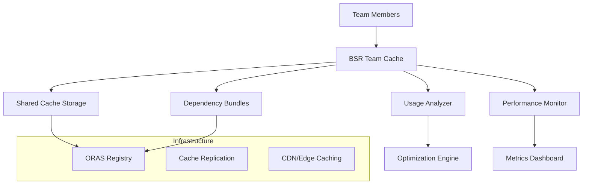

# BSR Team Caching Optimization

This document describes the team-optimized BSR (Buf Schema Registry) caching system that dramatically improves build performance for collaborative development teams.

## Overview

The BSR team caching system provides:

- **Shared Caches**: Team members share cached dependencies to reduce bandwidth and storage
- **Dependency Bundling**: Frequently used dependencies are bundled for faster downloads
- **Usage Pattern Analysis**: Automatic optimization based on team usage patterns
- **Performance Monitoring**: Real-time metrics and optimization recommendations
- **Buck2 Integration**: Seamless integration with Buck2 build system

## Architecture



## Key Components

### 1. BSR Client (`tools/bsr_client.py`)

Basic BSR client for dependency management:

```python
from bsr_client import BSRClient, BSRDependency

# Initialize BSR client
bsr_client = BSRClient(
    registry_url="buf.build",
    team="platform-team",
    cache_dir="/tmp/bsr-cache"
)

# Resolve dependencies from buf.yaml
dependencies = bsr_client.resolve_dependencies(Path("buf.yaml"))

# Download a specific dependency
dep = BSRDependency(
    name="googleapis",
    version="v1.0.0",
    digest="",
    repository="buf.build/googleapis"
)
output_path = bsr_client.download_dependency(dep, Path("./deps"))
```

### 2. Team Cache System (`tools/bsr_team_oras_cache.py`)

Main team caching orchestration:

```python
from bsr_team_oras_cache import BSRTeamOrasCache
from oras_client import OrasClient

# Initialize clients
oras_client = OrasClient("oras.birb.homes", "/tmp/cache")
team_cache = BSRTeamOrasCache(
    team="platform-team",
    bsr_client=bsr_client,
    oras_client=oras_client
)

# Enable shared cache for team
team_cache.enable_shared_cache([
    "alice", "bob", "charlie", "david"
])

# Create dependency bundle
bundle_ref = team_cache.create_dependency_bundle(
    dependencies=[
        "buf.build/googleapis/googleapis:v1.0.0",
        "buf.build/grpc/grpc:v1.5.0"
    ],
    bundle_name="platform-apis",
    description="Common platform API dependencies"
)

# Monitor performance
metrics = team_cache.monitor_cache_performance()
print(f"Cache hit rate: {metrics.cache_hit_rate:.1%}")
```

### 3. Buck2 Rules (`rules/bsr_team_cache.bzl`)

Buck2 integration for team caching:

```python
load("//rules:bsr_team_cache.bzl", "setup_team_cache", "dependency_bundle")

# Set up team cache
setup_team_cache(
    name = "platform_team_cache",
    team = "platform-team",
    members = ["alice", "bob", "charlie", "david"],
    cache_strategy = "aggressive",
    bundle_dependencies = [
        "buf.build/googleapis/googleapis:v1.0.0",
        "buf.build/grpc/grpc:v1.5.0",
    ],
)
```

## Quick Start

### 1. Basic Team Setup

```bash
# Set up team cache
python3 tools/bsr_team_oras_cache.py \
    --team platform-team \
    setup \
    --members alice bob charlie david

# Create a dependency bundle
python3 tools/bsr_team_oras_cache.py \
    --team platform-team \
    bundle \
    --name common-apis \
    --deps "buf.build/googleapis/googleapis:v1.0.0" \
           "buf.build/grpc/grpc:v1.5.0" \
    --description "Common API dependencies"
```

### 2. Buck2 Integration

Create a `BUCK` file with team caching:

```python
load("//rules:bsr_team_cache.bzl", "setup_team_cache")
load("//rules:proto.bzl", "proto_library")

# Set up team cache
setup_team_cache(
    name = "team_cache",
    team = "backend-team",
    members = ["alice", "bob", "charlie"],
    cache_strategy = "balanced",
    bundle_dependencies = [
        "buf.build/googleapis/googleapis:v1.0.0",
        "buf.build/grpc/grpc:v1.5.0",
    ],
)

# Use team cache in proto library
proto_library(
    name = "user_service_proto",
    srcs = ["user_service.proto"],
    deps = [
        "buf.build/googleapis/googleapis:v1.0.0",
    ],
    team = "backend-team",  # Enable team caching
)
```

### 3. Performance Monitoring

```bash
# Monitor team cache performance
python3 tools/bsr_team_oras_cache.py \
    --team platform-team \
    monitor

# Get optimization recommendations
python3 tools/bsr_team_oras_cache.py \
    --team platform-team \
    recommend
```

## Configuration Options

### Team Cache Configuration

| Option | Description | Default |
|--------|-------------|---------|
| `cache_strategy` | Caching aggressiveness (aggressive/balanced/conservative) | `balanced` |
| `shared_cache` | Enable shared cache across team members | `true` |
| `bundle_auto_creation` | Automatically create bundles for common patterns | `true` |
| `max_cache_size_mb` | Maximum cache size in MB | `1000` |
| `sync_frequency_minutes` | Cache sync frequency | `60` |

### Cache Strategies

**Aggressive Caching:**
- Cache everything (>2GB storage)
- Preload top 20 dependencies
- 30-minute sync frequency
- Suitable for: Large teams, high dependency usage

**Balanced Caching:**
- Cache frequently used dependencies (1GB storage)
- Preload top 10 dependencies  
- 60-minute sync frequency
- Suitable for: Medium teams, moderate usage

**Conservative Caching:**
- Cache only hot dependencies (500MB storage)
- Preload top 5 dependencies
- 120-minute sync frequency
- Suitable for: Small teams, low dependency usage

## Performance Targets

The system is designed to achieve:

| Metric | Target | Description |
|--------|--------|-------------|
| **Cache Hit Rate** | >95% | For common team dependencies |
| **Storage Reduction** | >50% | Through shared caching |
| **Download Time** | >60% faster | Via dependency bundling |
| **Build Time** | >30% faster | Overall build improvement |
| **Cache Lookup** | <100ms | Cache hit latency |

## Usage Patterns Analysis

The system automatically analyzes team usage patterns:

### Dependency Co-occurrence

```python
# Example: Identifying bundling opportunities
{
    "primary_dependency": "buf.build/googleapis/googleapis:v1",
    "related_dependencies": [
        {
            "dependency": "buf.build/grpc/grpc:v1",
            "co_occurrence_score": 0.85,
            "usage_count": 45
        }
    ],
    "bundle_score": 120
}
```

### Peak Usage Analysis

```python
# Example: Peak usage hours for cache warming
{
    "team": "platform-team",
    "peak_hours": [9, 14, 16],  # 9 AM, 2 PM, 4 PM
    "recommendations": [
        "Pre-warm cache at 8 AM daily",
        "Schedule maintenance during off-peak hours"
    ]
}
```

## Advanced Features

### 1. Automatic Bundle Creation

The system automatically identifies bundling opportunities:

```python
# Bundles are created when dependencies are frequently used together
bundle_opportunities = [
    {
        "name": "googleapis-grpc-bundle",
        "dependencies": [
            "buf.build/googleapis/googleapis:v1",
            "buf.build/grpc/grpc:v1"
        ],
        "co_occurrence": 0.85,
        "potential_savings": "60% download time reduction"
    }
]
```

### 2. Smart Cache Warming

Cache warming based on usage patterns:

```python
# Pre-warm cache before peak hours
warming_schedule = {
    "daily": {
        "time": "08:00",
        "dependencies": [
            "buf.build/googleapis/googleapis:v1",
            "buf.build/grpc/grpc:v1"
        ]
    },
    "weekly": {
        "day": "monday",
        "time": "06:00",
        "action": "full_cache_refresh"
    }
}
```

### 3. Cross-Team Collaboration

Teams can share bundles and dependencies:

```python
# Share bundle with another team
team_cache.share_bundle(
    bundle_name="common-apis",
    target_teams=["frontend-team", "mobile-team"],
    permissions="read-only"
)
```

## Examples

### Example 1: Platform Team Setup

A platform team with common API dependencies:

```python
# Platform team BUCK file
load("//rules:bsr_team_cache.bzl", "setup_team_cache")

setup_team_cache(
    name = "platform_cache",
    team = "platform-team",
    members = [
        "alice@company.com",
        "bob@company.com", 
        "charlie@company.com",
        "david@company.com"
    ],
    cache_strategy = "aggressive",
    bundle_dependencies = [
        "buf.build/googleapis/googleapis:v1.0.0",
        "buf.build/grpc/grpc:v1.5.0",
        "buf.build/envoyproxy/envoy:v1.24.0",
        "buf.build/istio/istio:v1.16.0"
    ],
    monitor_performance = True,
)

# Services using the team cache
proto_library(
    name = "user_service",
    srcs = ["user_service.proto"],
    deps = ["buf.build/googleapis/googleapis:v1.0.0"],
    team = "platform-team",
)

proto_library(
    name = "payment_service", 
    srcs = ["payment_service.proto"],
    deps = [
        "buf.build/googleapis/googleapis:v1.0.0",
        "buf.build/grpc/grpc:v1.5.0"
    ],
    team = "platform-team",
)
```

### Example 2: Multi-Team Organization

Organization with multiple teams sharing dependencies:

```python
# Backend team
setup_team_cache(
    name = "backend_cache",
    team = "backend-team", 
    members = ["backend-dev1", "backend-dev2", "backend-dev3"],
    cache_strategy = "balanced",
    bundle_dependencies = [
        "buf.build/googleapis/googleapis:v1.0.0",
        "buf.build/grpc/grpc:v1.5.0",
    ],
)

# Frontend team  
setup_team_cache(
    name = "frontend_cache",
    team = "frontend-team",
    members = ["frontend-dev1", "frontend-dev2"],
    cache_strategy = "conservative",
    bundle_dependencies = [
        "buf.build/googleapis/googleapis:v1.0.0",
        "buf.build/grpc-web/grpc-web:v1.3.0",
    ],
)

# Shared dependencies bundle
dependency_bundle(
    name = "org_common_bundle",
    bundle_name = "organization-common",
    dependencies = [
        "buf.build/googleapis/googleapis:v1.0.0",
    ],
    team = "platform-team",  # Owned by platform team
    description = "Dependencies shared across all teams",
)
```

## Monitoring and Optimization

### Performance Dashboard

The system provides real-time metrics:

```bash
# Team cache performance dashboard
Cache Performance for team platform-team:
  Hit Rate: 94.2%
  Build Time Improvement: 28.5%
  Bandwidth Saved: 1,247.3MB
  Shared Cache Efficiency: 67.8%
  Bundle Usage Rate: 45.2%
  
Recent Trends:
  📈 Hit rate improved 5.2% this week
  📊 Bundle usage increased 12% 
  ⚡ Average build time down 15 seconds
```

### Optimization Recommendations

Automated recommendations based on usage:

```bash
Cache Recommendations for team platform-team:
1. [HIGH] preload_dependencies
   Preload top 5 dependencies for faster access
   Expected improvement: 20-30% faster dependency resolution

2. [MEDIUM] create_bundle  
   Create bundle for 8 frequently used dependencies
   Expected improvement: 40-60% reduction in download time

3. [MEDIUM] increase_cache_size
   Increase cache size to improve hit rate
   Current hit rate: 75.2%
   Expected improvement: Improve cache hit rate to >85%
```

## Troubleshooting

### Common Issues

**Low Cache Hit Rate (<80%)**
- Increase cache size limit
- Review dependency patterns
- Check cache eviction policy

**High Bandwidth Usage**
- Enable dependency bundling
- Optimize bundle composition
- Review cache sync frequency

**Build Time Regression**
- Check cache warming schedule
- Verify shared cache connectivity
- Review team usage patterns

### Debug Commands

```bash
# Debug cache status
python3 tools/bsr_team_oras_cache.py \
    --team platform-team \
    --verbose \
    monitor

# Clear cache for testing
python3 tools/bsr_team_oras_cache.py \
    --team platform-team \
    sync

# Test bundle creation
python3 tools/bsr_team_oras_cache.py \
    --team platform-team \
    bundle \
    --name test-bundle \
    --deps "buf.build/googleapis/googleapis:v1.0.0" \
    --description "Test bundle"
```

## Integration with Infrastructure

### ORAS Registry Integration

The system integrates with `oras.birb.homes` for artifact storage:

```yaml
# Registry structure
oras.birb.homes/
├── teams/
│   ├── platform-team/
│   │   ├── dependencies/
│   │   │   └── googleapis-v1.0.0
│   │   └── bundles/
│   │       └── common-apis:latest
│   └── backend-team/
│       ├── dependencies/
│       └── bundles/
└── shared/
    └── organization/
        └── bundles/
            └── org-common:latest
```

### Infrastructure Requirements

See [BSR_TEAM_CACHING_INFRASTRUCTURE_REQUIREMENTS.md](../BSR_TEAM_CACHING_INFRASTRUCTURE_REQUIREMENTS.md) for detailed infrastructure specifications.

## Best Practices

### Team Organization

1. **Define Clear Team Boundaries**: Separate teams by domain/responsibility
2. **Identify Common Dependencies**: Group frequently shared dependencies
3. **Set Appropriate Cache Strategies**: Match strategy to team size and usage
4. **Monitor Performance Regularly**: Use automated monitoring and alerts

### Bundle Management

1. **Semantic Bundling**: Group related dependencies logically
2. **Version Consistency**: Use consistent versions within bundles
3. **Regular Updates**: Keep bundles up to date with latest versions
4. **Cross-Team Coordination**: Share bundles between related teams

### Performance Optimization

1. **Cache Warming**: Pre-populate cache during off-peak hours
2. **Usage Analysis**: Regularly review usage patterns
3. **Storage Management**: Monitor and optimize cache storage usage
4. **Network Optimization**: Use regional cache replicas for global teams

## Security Considerations

### Access Control

- Team-based access to shared caches
- Role-based permissions for bundle management
- Audit logging for all cache operations

### Data Security

- Encryption at rest for cached dependencies
- Secure transport (TLS) for all cache operations
- Integrity verification for all cached artifacts

## Conclusion

The BSR team caching optimization system provides significant performance improvements for development teams through intelligent caching, dependency bundling, and usage pattern optimization. By following the guidelines in this documentation, teams can achieve the target performance improvements while maintaining security and reliability.

For support or questions, refer to the [troubleshooting section](#troubleshooting) or contact the infrastructure team.
