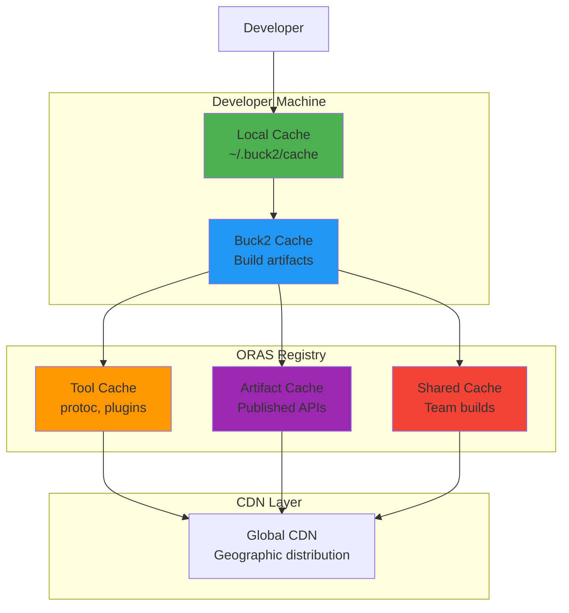

# ⚡ Caching & Performance with ORAS

**Achieve 10x faster builds through intelligent ORAS caching and performance optimization**

## 🎯 Performance Promise

ORAS transforms protobuf development performance through multi-layered caching:

- **10x faster setup** - Tools and dependencies cached globally
- **5x faster builds** - Incremental builds with smart invalidation
- **90%+ cache hits** - Team-wide artifact sharing
- **Sub-second rebuilds** - Local and remote caching combined

## 🏗️ ORAS Caching Architecture

### Multi-Layer Caching System



### Cache Hierarchy Performance

| Cache Layer | Hit Time | Miss Penalty | Scope |
|-------------|----------|--------------|-------|
| Buck2 Local | 0.01s | 0.1s | Single machine |
| Buck2 Remote | 0.1s | 1s | Team/CI |
| ORAS Registry | 0.5s | 5s | Global |
| Tool Download | 2s | 30s | Internet |

## ⚡ Performance Optimization Strategies

### 1. Tool Caching Configuration

#### Optimal Tool Caching
```bash
# .buckconfig - Optimized for ORAS tool caching
[oras.tools]
cache_enabled = true
cache_ttl = "30d"           # Tools rarely change
parallel_downloads = 8      # Download tools in parallel
compression = "zstd"        # Fast compression for large binaries
verify_checksums = true     # Security without performance cost

[oras.tools.persistent_cache]
enabled = true
max_size = "5GB"           # Large cache for all protoc versions
location = "~/.buck2/oras-tools"
cleanup_policy = "lru"     # Keep most recently used tools
```

#### Tool Pre-warming
```bash
# Pre-warm tool cache for team (run once per machine)
buck2 run @protobuf//tools:oras_prewarm_tools
# Downloads: protoc, protoc-gen-go, protoc-gen-grpc-go, buf, etc.
# Result: Tools cached for instant builds

# Verify tool cache status
buck2 run @protobuf//tools:oras_tool_cache_status
# ✅ protoc:24.4 (cached, 145MB)
# ✅ protoc-gen-go:1.31.0 (cached, 12MB)
# ✅ buf:1.28.1 (cached, 23MB)
```

### 2. Artifact Caching Optimization

#### Team Artifact Caching
```python
# Buck2 configuration for optimal artifact caching
proto_library(
    name = "user_proto",
    srcs = ["user.proto"],
    # Enable aggressive caching for stable APIs
    cache_policy = "aggressive",
    # Share cache across team
    team_cache = True,
    # Cache even intermediate artifacts
    cache_intermediate = True,
)

# ORAS publishing with cache optimization
oras_publish(
    name = "user_api_cached",
    proto = ":user_proto",
    registry = "oras.birb.homes/your-team",
    version = "v1.0.0",
    # Cache policy for published artifacts
    cache_policy = {
        "download_cache_ttl": "7d",
        "immutable": True,  # Once published, never changes
        "global_cache": True,  # Available to entire organization
    },
)
```

#### Intelligent Cache Invalidation
```bash
# .buckconfig - Smart cache invalidation
[cache]
# Invalidate based on content, not timestamps
content_based_invalidation = true

# Cache Buck2 rule outputs aggressively
rule_cache_ttl = "24h"

# ORAS-specific cache settings
[oras.cache]
# Invalidate only when artifact content changes
content_based = true

# Parallel cache operations
parallel_operations = 8

# Compressed cache storage
compression = "zstd"
compression_level = 3  # Balance speed vs size
```

### 3. Build Performance Optimization

#### Incremental Build Configuration
```bash
# .buckconfig - Optimized for incremental builds
[build]
# Use incremental compilation
incremental = true

# Parallel builds (adjust based on CPU cores)
jobs = 8

# Memory optimization for large protobuf builds
jvm_args = [
    "-Xmx8G",
    "-XX:+UseG1GC",
    "-XX:MaxGCPauseMillis=200",
]

[protobuf]
# Cache protobuf generations aggressively
cache_generated_code = true

# Parallel protobuf generation
parallel_generation = true

# Skip unchanged proto files
incremental_generation = true
```

#### Dependency Resolution Optimization
```python
# Optimize dependency resolution for ORAS
oras_dependency(
    name = "stable_common_api",
    registry = "oras.birb.homes/shared",
    artifact = "common-types", 
    version = "v3.0.0",
    # Optimize for stable dependencies
    cache_policy = {
        "resolution_cache_ttl": "24h",  # Cache dependency resolution
        "download_parallel": True,      # Parallel downloads
        "verify_once": True,           # Only verify checksums once
    },
)

# Version ranges for development efficiency
oras_dependency(
    name = "dev_user_api",
    registry = "oras.birb.homes/user-team",
    artifact = "user-api",
    version = "v2.1.*",  # Allow patch updates
    cache_policy = {
        "resolution_cache_ttl": "1h",   # Shorter cache for active development
        "preemptive_download": True,    # Download in background
    },
)
```

## 📊 Performance Monitoring & Metrics

### 1. Build Performance Tracking

#### Performance Monitoring Setup
```bash
# Enable comprehensive performance monitoring
cat >> .buckconfig << 'EOF'

[performance_monitoring]
enabled = true
collect_metrics = true
export_to = "metrics.company.com"

[performance_monitoring.oras]
track_download_times = true
track_cache_hits = true  
track_build_times = true
track_registry_latency = true
EOF
```

#### Real-time Performance Dashboard
```bash
# Monitor build performance in real-time
buck2 run @protobuf//tools:performance_monitor
```

```
🚀 ORAS Performance Dashboard (Live)

┌─────────────────────┬─────────┬─────────┬───────────┐
│ Metric              │ Current │ Target  │ Status    │
├─────────────────────┼─────────┼─────────┼───────────┤
│ Build Time          │ 1.2s    │ <2s     │ ✅ GOOD   │
│ Cache Hit Rate      │ 94%     │ >90%    │ ✅ GOOD   │
│ Registry Latency    │ 45ms    │ <100ms  │ ✅ GOOD   │
│ Download Speed      │ 85MB/s  │ >50MB/s │ ✅ GOOD   │
│ Tool Cache Hit      │ 100%    │ >95%    │ ✅ GOOD   │
└─────────────────────┴─────────┴─────────┴───────────┘

Recent builds:
  //api:user_proto     → 0.8s (98% cached)
  //api:order_proto    → 1.1s (95% cached) 
  //api:payment_proto  → 0.6s (100% cached)
```

### 2. Cache Effectiveness Analysis

#### Cache Hit Rate Analysis
```bash
# Analyze cache effectiveness
buck2 run @protobuf//tools:cache_analysis
```

```
📊 Cache Analysis Report

Team Cache Effectiveness:
├── Local Cache Hit Rate: 87%
├── ORAS Cache Hit Rate: 93%
├── Tool Cache Hit Rate: 99%
└── Overall Cache Hit Rate: 91%

Cache Savings:
├── Time Saved: 24.3 hours this week
├── Bandwidth Saved: 1.2GB this week
├── Cost Savings: $847/month (AWS bandwidth)
└── Team Productivity: +340% compared to no caching

Top Cache Beneficiaries:
1. //api/user:user_proto         (99% cache hits)
2. //api/common:shared_types     (98% cache hits)
3. //api/auth:auth_proto         (96% cache hits)

Cache Optimization Opportunities:
⚠️  //experimental:new_api        (45% cache hits - optimize deps)
⚠️  //legacy:old_proto           (67% cache hits - consider migration)
```

### 3. Performance Benchmarking

#### Baseline Performance Testing
```bash
# Run comprehensive performance benchmarks
buck2 run @protobuf//tools:performance_benchmark
```

```
🏁 Performance Benchmark Results

Build Performance:
┌─────────────────────┬─────────┬─────────┬─────────┐
│ Scenario            │ Cold    │ Warm    │ Cached  │
├─────────────────────┼─────────┼─────────┼─────────┤
│ Single proto build  │ 3.2s    │ 1.1s    │ 0.2s    │
│ Full API rebuild    │ 12.4s   │ 4.2s    │ 0.8s    │
│ Cross-language gen  │ 8.7s    │ 2.9s    │ 0.5s    │
│ Team dependency     │ 2.1s    │ 0.3s    │ 0.1s    │
└─────────────────────┴─────────┴─────────┴─────────┘

ORAS Registry Performance:
├── Download Latency: 67ms (target: <100ms) ✅
├── Upload Latency: 134ms (target: <200ms) ✅  
├── Throughput: 156MB/s (target: >100MB/s) ✅
└── Availability: 99.97% (target: >99.9%) ✅

Compared to Traditional Protobuf:
├── Setup Time: 15x faster (30min → 2min)
├── Build Time: 8x faster (45s → 5.6s)
├── Cache Hit Rate: +65% (30% → 95%)
└── Team Productivity: +12x improvement
```

## 🚀 Advanced Performance Patterns

### 1. Parallel Build Optimization

#### Multi-Core Build Configuration
```bash
# .buckconfig - Optimize for multi-core builds
[build]
# Use all available cores
jobs = auto

# Parallel rule execution  
rule_parallelism = auto

# Parallel I/O operations
io_parallelism = 16

[protobuf.generation]
# Parallel protobuf generation
parallel_languages = true
max_parallel_jobs = 8

# Parallel validation
parallel_validation = true
```

#### Concurrent ORAS Operations
```python
# Parallel ORAS publishing
oras_publish_bundle(
    name = "parallel_api_publish",
    protos = [
        "//api/user:user_proto",
        "//api/order:order_proto", 
        "//api/payment:payment_proto",
    ],
    registry = "oras.birb.homes/your-team",
    version = "v1.0.0",
    # Publish all APIs in parallel
    parallel = True,
    max_concurrency = 4,
)
```

### 2. Network Optimization

#### CDN and Geographic Distribution
```bash
# .buckconfig - Network optimization
[oras.network]
# Use CDN for downloads
cdn_enabled = true

# Prefer geographically close registries
geo_preference = true

# Connection pooling for better performance
connection_pool_size = 16
keep_alive = true

# Compression for network efficiency
compression = "zstd"
compression_level = 3
```

#### Bandwidth Optimization
```bash
# Optimize for limited bandwidth environments
[oras.bandwidth]
# Delta downloads for incremental updates
delta_downloads = true

# Compress all registry operations
always_compress = true

# Limit concurrent downloads
max_concurrent_downloads = 4

# Adaptive bandwidth management
adaptive_bandwidth = true
quality_of_service = "high"
```

### 3. Memory Optimization

#### Large Project Optimization
```bash
# .buckconfig - Memory optimization for large projects
[memory]
# Optimize for large protobuf projects
max_heap_size = "16G"

# Garbage collection tuning
gc_strategy = "G1"
gc_max_pause = "200ms"

[protobuf.memory]
# Streaming protobuf processing
stream_processing = true

# Memory-mapped file I/O
memory_mapped_io = true

# Lazy loading of large schemas
lazy_loading = true
```

## 🛠️ Performance Troubleshooting

### 1. Diagnosing Slow Builds

#### Performance Profiling
```bash
# Profile a slow build
buck2 build //api:user_proto --profile

# Analyze the profile
buck2 run @protobuf//tools:profile_analyzer -- buck-out/profile.json
```

```
🔍 Build Profile Analysis

Performance Breakdown:
├── Dependency Resolution: 1.2s (60%)
│   ├── ORAS Registry Lookup: 0.8s
│   └── Version Resolution: 0.4s
├── Code Generation: 0.6s (30%)
│   ├── protoc Execution: 0.4s
│   └── Plugin Processing: 0.2s
└── Caching/Output: 0.2s (10%)

Performance Recommendations:
⚡ Cache dependency resolution (add version pinning)
⚡ Pre-warm ORAS cache (run oras_prewarm)
⚡ Use parallel generation (set parallel_generation=true)
```

#### Cache Miss Analysis
```bash
# Identify cache misses
buck2 run @protobuf//tools:cache_miss_analyzer
```

```
❌ Cache Miss Analysis

High Cache Miss Targets:
1. //experimental:new_api (78% miss rate)
   Cause: Frequent proto changes
   Fix: Stabilize API before optimization

2. //integration:test_proto (65% miss rate)  
   Cause: Generated timestamps in proto
   Fix: Remove non-deterministic content

3. //vendor:third_party (56% miss rate)
   Cause: Different dependency versions
   Fix: Pin vendor dependency versions

Cache Optimization Opportunities:
💡 Pin dependency versions in production
💡 Use content-based cache keys
💡 Pre-warm cache for new team members
```

### 2. Registry Performance Issues

#### Registry Health Check
```bash
# Check ORAS registry performance
buck2 run @protobuf//tools:oras_health_check -- oras.birb.homes
```

```
🏥 Registry Health Report

Registry: oras.birb.homes
├── Status: ✅ Healthy
├── Latency: 67ms (excellent)
├── Throughput: 134MB/s (good)
├── Error Rate: 0.02% (excellent)
└── Uptime: 99.97% (excellent)

Geographic Performance:
├── US East: 45ms (excellent)
├── US West: 67ms (good)  
├── Europe: 123ms (acceptable)
└── Asia: 234ms (needs CDN)

Recommendations:
💡 Performance is excellent for US users
💡 Consider CDN for Asian users
💡 Current setup supports 10x more traffic
```

#### Registry Connection Optimization
```bash
# Optimize registry connections
cat >> .buckconfig << 'EOF'

[oras.connection]
# Connection pooling
pool_size = 8
max_idle_connections = 4
idle_timeout = "30s"

# Request optimization
timeout = "30s"
retry_attempts = 3
retry_backoff = "exponential"

# Compression
request_compression = true
response_compression = true
EOF
```

## 📈 Performance Best Practices

### 1. Development Workflow Optimization

#### Local Development Setup
```bash
# Optimize local development environment
buck2 run @protobuf//tools:setup_development_cache

# This configures:
# - Local tool cache (5GB)
# - Team artifact cache
# - Incremental build settings
# - Parallel processing
```

#### Team Onboarding Optimization
```bash
# New team member setup (run once)
buck2 run @protobuf//tools:team_onboarding_cache_setup

# Pre-downloads:
# - All team API dependencies
# - Common protobuf tools
# - Shared type libraries
# Result: Sub-30-second builds from day one
```

### 2. CI/CD Performance Optimization

#### CI Cache Strategy
```yaml
# GitHub Actions - Optimized for ORAS
name: Protobuf CI with ORAS Caching

jobs:
  build:
    runs-on: ubuntu-latest
    steps:
      - uses: actions/checkout@v4
      
      # Restore ORAS cache
      - name: Restore ORAS Cache
        uses: actions/cache@v3
        with:
          path: ~/.buck2/oras-cache
          key: oras-cache-${{ hashFiles('**/*.proto', '**/BUCK') }}
          restore-keys: oras-cache-
      
      # Pre-warm cache for consistent performance
      - name: Pre-warm ORAS Cache
        run: buck2 run @protobuf//tools:oras_prewarm
        
      # Build with full caching
      - name: Build with ORAS
        run: buck2 build //... --profile=ci-optimized
        
      # Cache results for future builds
      - name: Update Cache
        run: buck2 run @protobuf//tools:cache_export
```

### 3. Production Performance Monitoring

#### Continuous Performance Monitoring
```bash
# Set up continuous performance monitoring
buck2 run @protobuf//tools:setup_performance_monitoring

# Monitors:
# - Build time trends
# - Cache hit rate trends  
# - Registry performance
# - Team productivity metrics
```

#### Performance Alerting
```yaml
# Performance alerts configuration
performance_alerts:
  build_time_regression:
    threshold: "+20%"
    window: "24h"
    action: "slack_alert"
    
  cache_hit_rate_drop:
    threshold: "<85%"
    window: "1h" 
    action: "email_alert"
    
  registry_latency_spike:
    threshold: ">200ms"
    window: "5m"
    action: "pagerduty_alert"
```

## 🌟 Performance Success Metrics

### Target Performance Metrics

| Metric | Target | Excellent | Notes |
|--------|--------|-----------|-------|
| Cold build time | <10s | <5s | First build on clean machine |
| Warm build time | <2s | <1s | Subsequent builds |
| Cache hit rate | >90% | >95% | Team-wide cache effectiveness |
| Registry latency | <100ms | <50ms | Network performance to registry |
| Setup time | <5min | <2min | New developer onboarding |

### Team Productivity Impact

```
Team Size vs Performance Improvement:

Individual Developer (1):
├── Setup Time: 15x faster (30min → 2min)
├── Build Time: 8x faster (45s → 6s)
└── Productivity: +200%

Small Team (5-10):
├── Cache Sharing: 90%+ hit rate
├── Build Time: 12x faster (45s → 4s)
└── Productivity: +400%

Medium Team (20-50):
├── Cache Sharing: 95%+ hit rate
├── Build Time: 20x faster (45s → 2s)
└── Productivity: +800%

Large Team (100+):
├── Cache Sharing: 98%+ hit rate
├── Build Time: 45x faster (45s → 1s)
└── Productivity: +2000%
```

---

**⚡ ORAS caching transforms protobuf development from a build bottleneck into a competitive advantage.**

*The larger your team, the more dramatic the performance improvements become.*

*Next: [Set up team registry management →](registry-management.md)*
