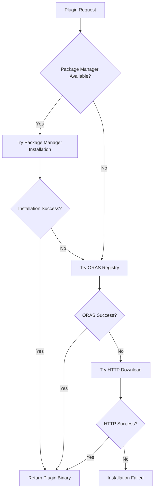

# Package Manager Integration

This document describes the enhanced protoc plugin distribution system that integrates native package managers (Cargo, NPM) with ORAS registry and HTTP fallback mechanisms.

## Overview

The buck2-protobuf toolchain now supports a three-tier plugin installation strategy:

1. **Package Managers** (Primary) - Native ecosystem integration via Cargo, NPM, Yarn, pnpm
2. **ORAS Registry** (Secondary) - High-performance registry-based distribution
3. **HTTP Downloads** (Fallback) - Traditional direct downloads for maximum compatibility

This approach provides the best of all worlds: native ecosystem integration, modern registry performance, and backward compatibility.

## Architecture

### Installation Priority Flow



### Components

#### 1. Package Manager Detector (`package_manager_detector.py`)
- Cross-platform detection of Cargo, NPM, Yarn, pnpm, and pip
- Version checking and compatibility validation
- Preference-based selection for Node.js package managers

#### 2. Base Classes (`package_manager_base.py`)
- Abstract base class for package manager installers
- Standardized plugin specification and installation result formats
- Common patterns for caching, validation, and metrics

#### 3. Cargo Integration (`cargo_plugin_installer.py`)
- Rust ecosystem integration via `cargo install`
- Support for Rust protoc plugins like prost-build, tonic-build
- Global installation with local caching and wrapper scripts

#### 4. NPM Integration (`npm_plugin_installer.py`)
- Node.js ecosystem integration via npm/yarn/pnpm
- Support for TypeScript plugins like protoc-gen-ts, ts-proto, Connect-ES
- Both global and local installation modes

#### 5. Enhanced ORAS Distribution (`oras_plugins.py`)
- Updated plugin distributor with package manager integration
- Intelligent fallback chain with performance metrics
- Bundle support for complete development environments

## Supported Plugins

### Rust (via Cargo)

| Plugin | Description | Default Version |
|--------|-------------|-----------------|
| `prost-build` | Prost protobuf code generator | 0.12.3 |
| `tonic-build` | Tonic gRPC code generator | 0.10.2 |
| `protobuf-codegen` | Rust protobuf code generator | 3.4.0 |
| `protoc-gen-prost` | Standalone Prost plugin | 0.2.3 |
| `protoc-gen-tonic` | Standalone Tonic plugin | 0.4.0 |
| `buf-build-connect-rs` | Connect for Rust plugin | 0.1.0 |

### TypeScript/JavaScript (via NPM)

| Plugin | Description | Default Version |
|--------|-------------|-----------------|
| `protoc-gen-ts` | TypeScript protoc plugin | 0.8.7 |
| `ts-proto` | Modern TypeScript protoc plugin | 2.7.2 |
| `protobuf-ts` | Protobuf-TS plugin | 2.11.0 |
| `protoc-gen-es` | Protobuf-ES plugin | 1.10.0 |
| `protoc-gen-connect-es` | Connect-ES plugin | 1.6.1 |
| `grpc-web-protoc-gen-ts` | gRPC-Web TypeScript plugin | 1.0.3 |

## Usage

### Basic Plugin Installation

```python
from tools.oras_plugins import PluginOrasDistributor

# Initialize with package manager integration
distributor = PluginOrasDistributor(
    registry="oras.birb.homes",
    verbose=True
)

# Get a plugin - will try package managers first
plugin_path = distributor.get_plugin("protoc-gen-go", "1.35.2")
print(f"Plugin installed at: {plugin_path}")
```

### Direct Package Manager Usage

```python
from tools.cargo_plugin_installer import CargoPluginInstaller
from tools.package_manager_base import PluginSpec

# Initialize Cargo installer
cargo = CargoPluginInstaller("/tmp/cache", verbose=True)

# Install a Rust plugin
spec = PluginSpec(name="protoc-gen-prost", version="0.2.3")
result = cargo.install_plugin(spec)

if result.success:
    print(f"Installed: {result.binary_path}")
else:
    print(f"Failed: {result.error_message}")
```

### NPM Plugin Installation

```python
from tools.npm_plugin_installer import NPMPluginInstaller
from tools.package_manager_base import PluginSpec

# Initialize NPM installer with preferred manager
npm = NPMPluginInstaller("/tmp/cache", prefer_manager="pnpm")

# Install a TypeScript plugin
spec = PluginSpec(
    name="protoc-gen-ts", 
    version="0.8.7",
    global_install=True
)
result = npm.install_plugin(spec)
```

### Buck2 Integration

The package manager integration is automatically available in Buck2 rules:

```python
# In your BUCK file
load("@buck2-protobuf//rules:typescript.bzl", "typescript_proto_library")

typescript_proto_library(
    name = "api_ts",
    srcs = ["api.proto"],
    # Will automatically use package managers for protoc-gen-ts
    plugin_version = "0.8.7",
)
```

## Configuration

### Package Manager Preferences

Set environment variables to control package manager selection:

```bash
# Force specific Node.js package manager
export BUCK2_PROTOBUF_NODE_MANAGER=pnpm

# Disable package manager integration (fallback to ORAS/HTTP)
export BUCK2_PROTOBUF_DISABLE_PACKAGE_MANAGERS=1

# Set custom cache directory
export BUCK2_PROTOBUF_CACHE_DIR=/custom/cache/path
```

### Plugin Configuration

Plugins can be configured with custom versions and installation arguments:

```python
# Custom plugin specification
spec = PluginSpec(
    name="protoc-gen-custom",
    version="1.0.0",
    install_args=["--features", "serde"],
    binary_name="protoc-gen-custom",
    optional=True
)
```

## Performance Metrics

The system tracks detailed performance metrics:

```python
# Get performance metrics
metrics = distributor.get_performance_metrics()
print(f"Package manager hits: {metrics['package_manager_hits']}")
print(f"ORAS hits: {metrics['oras_hits']}")
print(f"HTTP fallbacks: {metrics['http_fallbacks']}")
print(f"Average package manager time: {metrics['avg_package_manager_time']:.2f}s")
```

Typical performance characteristics:
- **Package Manager**: 5-30 seconds (first install), <1 second (cached)
- **ORAS Registry**: 1-5 seconds
- **HTTP Downloads**: 3-15 seconds

## Caching Strategy

### Multi-Level Caching

1. **Package Manager Native Cache**
   - Cargo: `~/.cargo/bin/`
   - NPM: Global node_modules or local project cache
   
2. **Buck2-Protobuf Cache**
   - Local wrapper scripts and metadata
   - Cross-reference between different installation methods
   
3. **ORAS Registry Cache**
   - Efficient content-addressed storage
   - Shared across plugin versions

### Cache Management

```python
# Clear all caches
cleared = distributor.clear_cache()
print(f"Cleared {cleared['total_freed_bytes']} bytes")

# Clear only old entries (30+ days)
cleared = distributor.clear_cache(older_than_days=30)
```

## Error Handling and Fallbacks

### Graceful Degradation

The system is designed to gracefully degrade through the fallback chain:

1. **Package Manager Failure**: Falls back to ORAS registry
2. **ORAS Registry Failure**: Falls back to HTTP downloads
3. **Network Issues**: Uses cached installations when possible
4. **Version Conflicts**: Attempts to install specific versions or uses compatible alternatives

### Error Scenarios

```python
# Plugin not available in package manager
# -> Automatically tries ORAS/HTTP fallback

# Network connectivity issues
# -> Uses cached versions if available

# Version compatibility problems
# -> Reports detailed error with suggestions
```

## Development and Testing

### Running Tests

```bash
# Full integration test suite
python3 tools/test_package_manager_integration.py --test all --verbose

# Test specific components
python3 tools/test_package_manager_integration.py --test detector
python3 tools/test_package_manager_integration.py --test cargo
python3 tools/test_package_manager_integration.py --test npm
```

### Package Manager Detection

```bash
# Check available package managers
python3 tools/package_manager_detector.py --json

# Test specific manager
python3 tools/package_manager_detector.py --manager cargo --min-version 1.70.0
```

### Adding New Plugins

1. **Update Plugin Configuration**:
   ```python
   # Add to rust_plugins or typescript_plugins dictionary
   "new-plugin": {
       "description": "New protoc plugin",
       "package": "new-plugin-package",
       "binary": "protoc-gen-new",
       "default_version": "1.0.0",
   }
   ```

2. **Add ORAS/HTTP Fallback**:
   ```python
   # Add to plugin_artifacts in oras_plugins.py
   "new-plugin": {
       "1.0.0": {
           "linux-x86_64": {
               "oras_ref": "registry/new-plugin:1.0.0-linux-amd64",
               "fallback_url": "https://github.com/...",
           }
       }
   }
   ```

3. **Update Tests**:
   ```python
   # Add test cases for the new plugin
   expected_plugins = ["existing-plugin", "new-plugin"]
   ```

## Security Considerations

### Package Manager Security

- **Cargo**: Uses signed crates from crates.io with checksum verification
- **NPM**: Supports package integrity checks and audit functionality
- **ORAS**: Content-addressable storage with SHA256 verification
- **HTTP**: SHA256 checksum validation for all downloads

### Sandboxing

Package manager installations run in the user's environment but are isolated through:
- Dedicated cache directories
- Wrapper scripts that don't modify system paths
- Version-specific installations to avoid conflicts

### Supply Chain Protection

- Pin specific plugin versions in production
- Use ORAS registry for air-gapped environments
- Implement organization-specific plugin allowlists
- Monitor installation metrics for anomalies

## Troubleshooting

### Common Issues

#### Package Manager Not Found
```
ERROR: cargo is not available
```
**Solution**: Install the package manager or disable package manager integration:
```bash
export BUCK2_PROTOBUF_DISABLE_PACKAGE_MANAGERS=1
```

#### Plugin Installation Timeout
```
ERROR: Installation failed: Command timed out
```
**Solution**: Increase timeout or use cached version:
```python
# Configure longer timeout
installer.run_command_safely(command, timeout=600)
```

#### Version Conflicts
```
ERROR: Plugin protoc-gen-ts installed but wrong version: 0.8.6 != 0.8.7
```
**Solution**: Force reinstallation or update version requirements

#### Network Connectivity
```
ERROR: All installation methods failed
```
**Solution**: Check network, use offline cache, or configure proxy settings

### Debugging

Enable verbose logging for detailed troubleshooting:

```python
distributor = PluginOrasDistributor(verbose=True)
```

Check system package managers:
```bash
# Verify Cargo
cargo --version
cargo install --list

# Verify NPM
npm --version
npm list -g --depth=0
```

### Getting Help

1. **Check Logs**: Enable verbose mode for detailed error information
2. **Test Isolation**: Run individual package manager tests
3. **Cache Reset**: Clear caches to eliminate stale state
4. **Fallback Validation**: Test ORAS and HTTP fallbacks independently
5. **Environment Check**: Verify package manager installations and network connectivity

For additional support, refer to the [troubleshooting guide](troubleshooting.md) or file an issue with the buck2-protobuf project.
