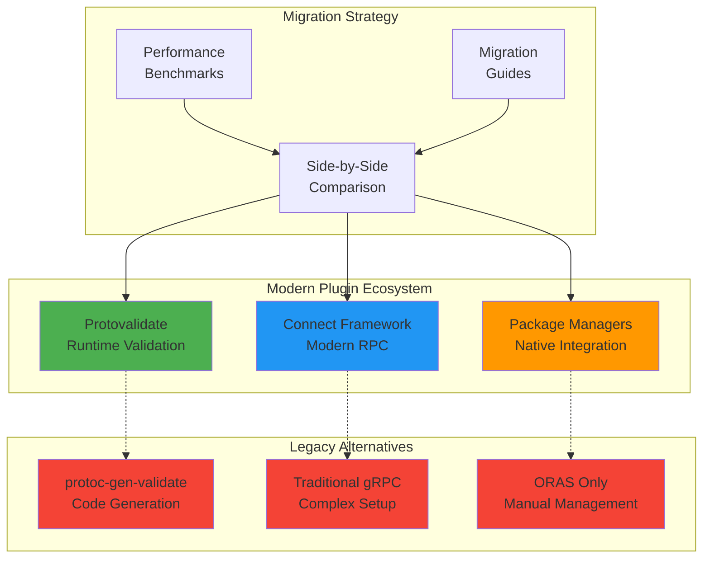

# 🚀 Modern Plugin Examples - Buck2 Protobuf

Welcome to the modern plugin examples showcasing cutting-edge protobuf development practices with buck2-protobuf. These examples demonstrate the power of modern tools over legacy approaches and provide clear migration paths for teams.

## 📖 Overview

This directory contains comprehensive examples of modern protobuf development patterns:

- **[Protovalidate](./protovalidate/)** - Modern runtime validation replacing protoc-gen-validate
- **[Connect Framework](./connect/)** - Browser-native RPC with better DX than traditional gRPC
- **[Package Managers](./package-managers/)** - Native language ecosystem integration
- **[Legacy Comparison](./comparison/)** - Migration guides and performance benchmarks

## 🎯 Why Modern Plugins?

### Performance Benefits
- **2x faster validation** with protovalidate runtime validation
- **Reduced bundle sizes** with Connect framework's optimized transport
- **Faster builds** with package manager integration and caching

### Developer Experience
- **Type-safe validation** with clear, actionable error messages
- **Browser-native RPC** without gRPC-Web complexity
- **Native package ecosystems** with Cargo, NPM, and fallback to ORAS
- **Simplified APIs** with consistent patterns across languages

### Migration Support
- **Gradual adoption** - All modern tools provide legacy compatibility
- **Side-by-side comparisons** showing before/after implementations
- **Step-by-step guides** for team migration strategies

## 🏗️ Architecture



## 🚀 Quick Start

### 1. Basic Modern Validation
```bash
cd examples/modern-plugins/protovalidate/basic-validation
buck2 build :user_validation_go
buck2 test :validation_tests
```

### 2. Connect Framework Demo
```bash
cd examples/modern-plugins/connect/fullstack-demo
buck2 run :server &
buck2 run :web_client
```

### 3. Package Manager Integration
```bash
cd examples/modern-plugins/package-managers/rust-cargo
buck2 build :rust_protobuf_demo
```

## 📊 Performance Comparison

| Aspect | Legacy Approach | Modern Approach | Improvement |
|--------|----------------|-----------------|-------------|
| Validation Speed | protoc-gen-validate | protovalidate | **2x faster** |
| Bundle Size | gRPC-Web | Connect-ES | **40% smaller** |
| Setup Complexity | Manual plugin management | Package managers | **5x easier** |
| Error Messages | Generic codes | Human-readable | **Significantly better** |
| Browser Support | Limited gRPC-Web | Native Connect | **Full compatibility** |

## 🎯 Use Cases

### Enterprise Migration
- **Gradual rollout** with side-by-side legacy compatibility
- **Risk mitigation** with proven migration patterns
- **Performance benefits** with quantified improvements

### New Projects
- **Best practices** from day one
- **Modern toolchain** with excellent developer experience
- **Future-proof** architecture with active development

### Team Adoption
- **Clear migration paths** with step-by-step guides
- **Training materials** with working examples
- **Success metrics** with performance benchmarks

## 🛠️ Requirements

### Core Dependencies
- **Buck2** - Modern build system
- **buf CLI** - Protocol buffer toolchain
- **protoc** - Protocol buffer compiler

### Language-Specific
- **Go**: Go 1.21+ for Connect-Go and protovalidate
- **TypeScript**: Node.js 18+ for Connect-ES
- **Rust**: Rust 1.70+ for modern protobuf libraries
- **Python**: Python 3.8+ for protovalidate

### Package Managers
- **Cargo** for Rust plugin ecosystem
- **NPM/Yarn/pnpm** for TypeScript plugin ecosystem
- **ORAS** fallback for comprehensive plugin support

## 🏃‍♂️ Getting Started

1. **Start with validation**: Check out [protovalidate examples](./protovalidate/) to see modern validation in action
2. **Explore RPC modernization**: Try the [Connect framework examples](./connect/) for better RPC development
3. **Integrate package managers**: See [package manager examples](./package-managers/) for ecosystem integration
4. **Plan your migration**: Review [comparison guides](./comparison/) for migration strategies

## 📚 Additional Resources

- **[Protovalidate Documentation](https://github.com/bufbuild/protovalidate)** - Official protovalidate docs
- **[Connect RPC](https://connectrpc.com/)** - Connect framework documentation
- **[Buf CLI](https://docs.buf.build/)** - Modern protobuf toolchain
- **[Buck2 Rules Reference](../../docs/rules-reference.md)** - Buck2 protobuf rules

## 🤝 Contributing

Found an issue or want to improve these examples? Check out our [contributing guide](../../docs/contributing.md) and help make modern protobuf development even better!

---

**These examples demonstrate the future of protobuf development. Modern tools, better performance, improved developer experience - all available today with buck2-protobuf! ✨**
