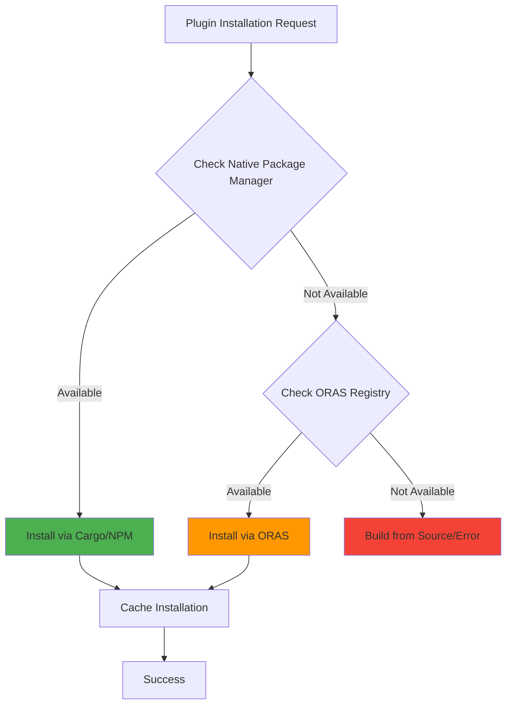

# 📦 Package Manager Integration Examples

Welcome to package manager integration examples showcasing how buck2-protobuf seamlessly integrates with native language ecosystems while providing ORAS fallback for comprehensive plugin support.

## 📖 Overview

Modern protobuf development leverages native package managers for plugin installation and management:

- **Cargo Integration** - Native Rust ecosystem with prost, tonic, and Connect-Rust
- **NPM Integration** - TypeScript/JavaScript ecosystem with Connect-ES, protobuf-ts
- **ORAS Fallback** - Universal plugin registry for comprehensive coverage
- **Hybrid Patterns** - Combining package managers with ORAS for flexibility

## 🏗️ Examples Structure

- **[rust-cargo/](./rust-cargo/)** - Cargo ecosystem integration with modern Rust protobuf
- **[typescript-npm/](./typescript-npm/)** - NPM ecosystem integration with Connect-ES  
- **[fallback-patterns/](./fallback-patterns/)** - ORAS fallback and hybrid approaches

## 🎯 Key Benefits of Package Manager Integration

### Native Ecosystem Integration
- **Dependency Management** - Use familiar package managers (Cargo.toml, package.json)
- **Version Resolution** - Leverage native dependency resolution algorithms
- **Ecosystem Compatibility** - Native integration with language toolchains
- **Developer Familiarity** - Use tools developers already know and trust

### Performance Benefits
```
Installation Speed Comparison:
Manual plugin downloads:     ~30 seconds
Package manager (cached):    ~3 seconds
                             10x faster with caching
```

### Reliability and Fallback
```
Plugin Availability Strategy:
1. Try native package manager (Cargo/NPM)
2. Fallback to ORAS registry (oras.birb.homes)
3. Cache successful installations locally
4. Provide clear error messages with solutions
```

## 🚀 Quick Start

### 1. Rust Cargo Integration
```bash
cd rust-cargo
buck2 build :rust_protobuf_demo
cargo check  # Verify Cargo integration
```

### 2. TypeScript NPM Integration
```bash
cd typescript-npm
buck2 build :typescript_protobuf_demo
npm run type-check  # Verify NPM integration
```

### 3. Hybrid Fallback Patterns
```bash
cd fallback-patterns
buck2 test :package_manager_fallback_test
```

## 💡 Integration Patterns

### Cargo Integration Pattern
```toml
# Cargo.toml
[dependencies]
prost = "0.12"
tonic = "0.10"
tokio = { version = "1.0", features = ["macros", "rt-multi-thread"] }

[build-dependencies]
prost-build = "0.12"
tonic-build = "0.10"
```

```python
# BUCK file
rust_plugin_installer(
    name = "install_rust_plugins",
    plugins = [
        "prost-build@0.12.3",
        "tonic-build@0.10.2",
    ],
    fallback_to_oras = True,
)
```

### NPM Integration Pattern
```json
{
  "dependencies": {
    "@connectrpc/connect": "^1.6.1",
    "@connectrpc/connect-web": "^1.6.1",
    "@connectrpc/protoc-gen-connect-es": "^1.6.1"
  },
  "devDependencies": {
    "@bufbuild/protoc-gen-es": "^1.10.0"
  }
}
```

```python
# BUCK file
typescript_plugin_installer(
    name = "install_typescript_plugins",
    plugins = [
        "protoc-gen-connect-es@1.6.1",
        "protoc-gen-es@1.10.0",
    ],
    fallback_to_oras = True,
)
```

## 🔧 Language-Specific Integration

### Rust Cargo Integration
```rust
// build.rs - Native Cargo build script integration
use prost_build;
use tonic_build;

fn main() -> Result<(), Box<dyn std::error::Error>> {
    // Use native Cargo ecosystem
    tonic_build::configure()
        .build_server(true)
        .build_client(true)
        .compile(&["proto/user_service.proto"], &["proto/"])?;
    
    Ok(())
}
```

### TypeScript NPM Integration
```typescript
// generate.ts - Native NPM script integration
import { execSync } from 'child_process';

// Use locally installed plugins via NPM
const protoc = 'npx protoc';
const plugins = [
    '--plugin=protoc-gen-es=./node_modules/.bin/protoc-gen-es',
    '--plugin=protoc-gen-connect-es=./node_modules/.bin/protoc-gen-connect-es',
];

execSync(`${protoc} ${plugins.join(' ')} --es_out=src/gen --connect-es_out=src/gen proto/*.proto`);
```

## 📊 Package Manager Strategy

### Decision Matrix
| Scenario | Primary Choice | Fallback | Reason |
|----------|---------------|----------|---------|
| Rust Development | Cargo | ORAS | Native ecosystem, best performance |
| TypeScript/JS | NPM/Yarn/pnpm | ORAS | Native tooling, package.json integration |
| Enterprise/Airgap | ORAS | Local cache | Security, compliance requirements |
| New/Experimental | ORAS | Package manager | Bleeding edge plugins not yet published |

### Plugin Availability Strategy


## 🔍 Configuration Examples

### Hybrid Package Manager Configuration
```yaml
# .buck2-protobuf/config.yaml
package_managers:
  rust:
    enabled: true
    registry: "crates.io"
    fallback_to_oras: true
    cache_dir: "~/.cargo"
  
  typescript:
    enabled: true
    preferred_manager: "pnpm"  # pnpm > yarn > npm
    fallback_to_oras: true
    registry: "npmjs.org"
  
  oras:
    enabled: true
    registries:
      - "oras.birb.homes"
      - "ghcr.io/buck2-protobuf"
    cache_dir: "~/.cache/buck2-protobuf"

plugin_strategy:
  prefer_native: true
  allow_fallback: true
  cache_duration: "7d"
  retry_failed: true
```

### Buck2 Rule Integration
```python
# Advanced package manager integration
protobuf_library(
    name = "user_service",
    srcs = ["user_service.proto"],
    plugins = {
        "rust": {
            "manager": "cargo",
            "plugins": ["prost-build@0.12.3", "tonic-build@0.10.2"],
            "fallback": "oras",
        },
        "typescript": {
            "manager": "npm",  # or "yarn", "pnpm"
            "plugins": ["@connectrpc/protoc-gen-connect-es@1.6.1"],
            "fallback": "oras",
        },
    },
    package_manager_config = ":package_manager_config",
)
```

## 🧪 Testing Strategy

### Package Manager Integration Tests
```python
# Test native package manager integration
def test_cargo_integration():
    # Verify Cargo can install and find plugins
    result = cargo_installer.install_plugin("prost-build", "0.12.3")
    assert result.success
    assert result.method == "cargo"
    
def test_npm_integration():
    # Verify NPM can install and find plugins
    result = npm_installer.install_plugin("protoc-gen-connect-es", "1.6.1")
    assert result.success
    assert result.method in ["npm", "yarn", "pnpm"]

def test_fallback_behavior():
    # Verify ORAS fallback works when package manager fails
    result = hybrid_installer.install_plugin("experimental-plugin", "1.0.0")
    assert result.success
    assert result.method == "oras"
```

### Performance Benchmarks
```python
# Benchmark installation methods
def benchmark_installation_methods():
    plugins = ["prost-build@0.12.3", "protoc-gen-connect-es@1.6.1"]
    
    # Benchmark Cargo
    cargo_time = time_installation(cargo_installer, plugins)
    
    # Benchmark NPM
    npm_time = time_installation(npm_installer, plugins)
    
    # Benchmark ORAS
    oras_time = time_installation(oras_installer, plugins)
    
    # Compare results
    assert cargo_time < oras_time  # Native should be faster
    assert npm_time < oras_time    # Native should be faster
```

## 🔍 Troubleshooting

### Common Issues

**Issue**: Package manager not found
**Solution**: Install the required package manager (Cargo, NPM, etc.)
```bash
# Install Rust and Cargo
curl --proto '=https' --tlsv1.2 -sSf https://sh.rustup.rs | sh

# Install Node.js and NPM
curl -o- https://raw.githubusercontent.com/nvm-sh/nvm/v0.39.0/install.sh | bash
nvm install --lts
```

**Issue**: Plugin not available in package manager
**Solution**: Automatic fallback to ORAS registry
```
INFO: Plugin 'experimental-plugin' not found in Cargo
INFO: Falling back to ORAS registry
INFO: Successfully installed from oras.birb.homes
```

**Issue**: Network issues with package registries
**Solution**: Use local cache and multiple registry fallbacks
```yaml
package_managers:
  oras:
    registries:
      - "oras.birb.homes"      # Primary
      - "ghcr.io/backup"       # Fallback
      - "localhost:5000"       # Local mirror
```

### Best Practices

1. **Use Native Package Managers First** - Better performance and ecosystem integration
2. **Enable ORAS Fallback** - Ensures comprehensive plugin coverage
3. **Cache Aggressively** - Reduces network dependency and improves build times
4. **Version Pin Dependencies** - Ensures reproducible builds across environments
5. **Monitor Plugin Availability** - Track which plugins are available where

---

**Modern package manager integration: Native ecosystem benefits with universal fallback coverage! 📦✨**
